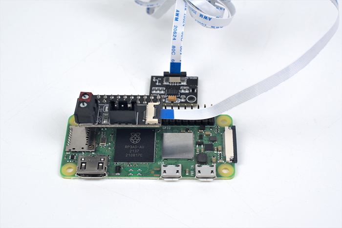

# commands to run from printer console

## misc
* `FIRMWARE_RESTART` - restart RT board (BTT Octopus)
* `RESTART` - restart `klipper`
* `M114` - return current XYZE positions
* `G28` - home all axis
* `G90` - absolute positioning mode

## move steppers around
* `STEPPER_BUZZ STEPPER=stepper_x`
* `STEPPER_BUZZ STEPPER=stepper_y`
* `STEPPER_BUZZ STEPPER=stepper_z`
* `STEPPER_BUZZ STEPPER=stepper_z1`
* `STEPPER_BUZZ STEPPER=stepper_z2`
* `STEPPER_BUZZ STEPPER=stepper_z3`
* `STEPPER_BUZZ STEPPER=extruder`
* `G0 X175 Y175 Z150 F9000` - go to 350x350mm bed's center, 15cm above bed, at higher speed

## status
* `STATUS` - `klipper` status (connected/disconnected)
* `QUERY_ENDSTOPS` - XYZ
* `QUERY_PROBE` - bed leveling probe

## calibration

### heaters
* [voron docs](https://docs.vorondesign.com/build/startup/#pid-tune-bed--hotend).
* `TURN_OFF_HEATERS`
* `M106 S64` - set PCF to 25%
* `PID_CALIBRATE HEATER=extruder TARGET=250`
* `PID_CALIBRATE HEATER=heater_bed TARGET=100`
* `SAVE_CONFIG` to save new PID settings

### probe
* `PROBE` - check the Z height when probe hits the bed
* `PROBE_CALIBRATE` - calibration of offset between bed probe (klicky probe test) and nozzle (manual "paper test")
* `SAVE_CONFIG` - write config to disk (klipper)
* `PROBE_ACCURACY` - make sure min/max are no more than 0.005mm apart

#### auto z
* calibration process:
  * [principle of operation](https://github.com/protoloft/klipper_z_calibration/wiki/What-It-Does)
  * [configuration process](https://github.com/protoloft/klipper_z_calibration/wiki/How-To-Configure-It)
  * [video intro](https://www.youtube.com/watch?v=oQYHFecsTto)
* `CALIBRATE_Z` - calibrate z offset towards the bed (should be ran before each print)
* `CALCULATE_SWITCH_OFFSET` - find good height with a piece of paper and run this to calculate the value

### Z motors
* `ENDSTOP_PHASE_CALIBRATE STEPPER=stepper_z` - [endstop phase calibration](https://www.klipper3d.org/Endstop_Phase.html).
on CoreXY makes sense only on Z axis.
* `SAVE_CONFIG` - write config to disk (klipper)

### input shaping

* docs:
  * [klipper - measuring resonances](https://www.klipper3d.org/Measuring_Resonances.html).
  * [klipper - resonance compenstation](https://www.klipper3d.org/Resonance_Compensation.html).
  * [LDO ADXL345 input shaper toolkit](https://docs.ldomotors.com/adxl_tool).
* turn on SPI with `raspi-config`
* `ACCELEROMETER_QUERY` - check if accelerometer is responding
* `TEST_RESONANCES AXIS=X` or `TEST_RESONANCES AXIS=Y` - test resonances of a particular axis
* `SHAPER_CALIBRATE` - actual calibration test
* `SAVE_CONFIG` - save input shaping results

### bed mesh
* `BED_MESH_CALIBRATE`
* `BED_MESH_PROFILE SAVE=<name>`
* `BED_MESH_PROFILE LOAD=<name>`
* `BED_MESH_PROFILE REMOVE=<name>`
